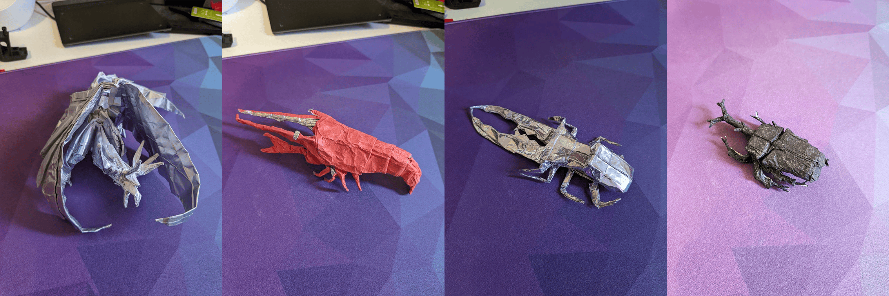

Origami is something that I was first introduced to around the time I was in kindergarten, where I learned how to fold simple things like fortune tellers or boats. Around the time I was 7/8, I learned about more advanced models and developed an obsession from there. 

I joined the Origami Society of Toronto in 2013, and in 2014 I volunteered for their booth at the Toronto Maker Faire. Even though I was mainly there to help with teaching origami, this would be my first introduction to "Maker" culture and all the cool stuff with it: welding, web projects, battle bots, you name it.

At the start of 2016 I slowly stopped folding, instead being enthralled by other things like Arduino projects.

Pictured from left to right is:
- Ancient Dragon by Satoshi Kamiya. Folded in 2015
- American Lobster by John Montroll. Folded in 2014
- Cyclommatus Metallifer by Satoshi Kamiya. Folded in 2014
- Samurai Helmet Beatle by Robert J. Lang. Folded in 2014